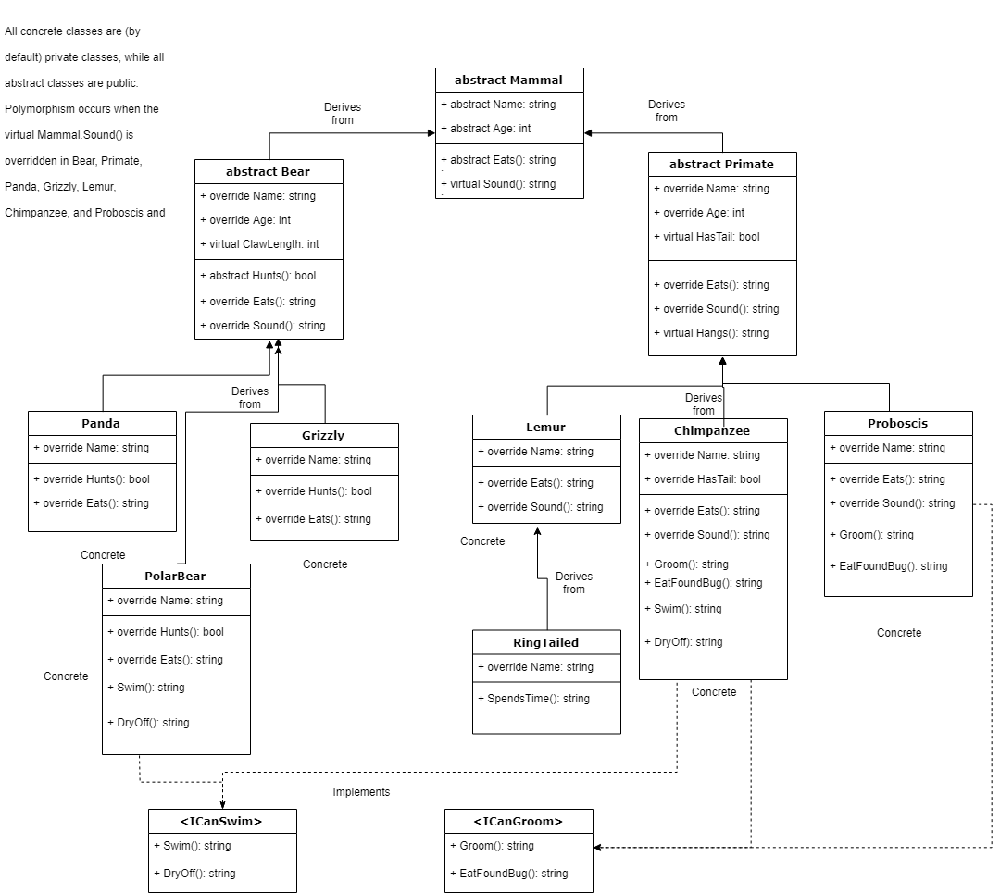

# Lab05-IBuiltAZoo
A series of class definitions in C# for practicing inheritance, abstraction, and polymorphism. The classes can be used to implement a "zoo" of animal objects.

There is one abstract base class, Mammal, from which all other classes descend. Please refer to the diagram below for details.

## Class Diagram

## Explanation of OOP Principles and How They're Used in I Built A Zoo
* Encapsulation:
* Inheritance:
* Abstraction:
* Polymorphism:
